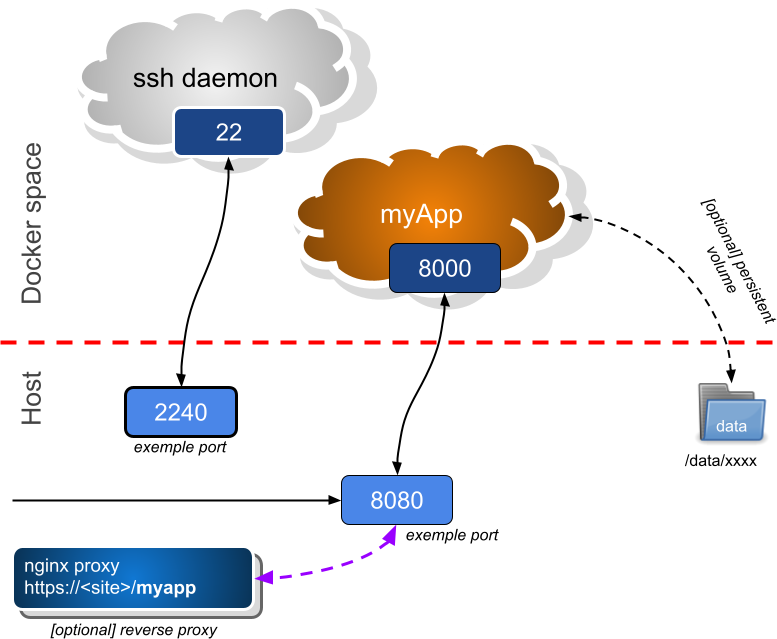

# neOCampus / eCOnect / ... base container for python developments #
_____________________________________________________________________

**WHY THIS ???**

**Because `docker` is a root only command hence we allow you to login root within your container**

*(behind the hood is `supervisord`)*

This docker container enables you to become **root** in your container. Especially, this container features the following cvapabilities:

  - SSH daemon --> enables you to log as root within the container
  - one port to have your `/app/xxx` reachable from the internet
  - **NO persistant volume** --> if you need it, ask me !
  - *[TODO] Prometheus end-point (internal monitoring)*



### config check example
`DOCKER_BASE_CONTAINER_NAME="malik" DOCKER_BASE_SSH_PORT="2242" DOCKER_BASE_APP_PORT="8087" docker-compose config`

```
services:
  app:
    build:
      context: /root/docker-base
    container_name: malik
    environment:
      DEBUG: null
      FLASK_DEBUG: null
      FLASK_ENV: null
      INFLUX_BUCKETS: '[ ''sensors_hires'', ''sensors_lowres'' ]'
      INFLUX_ORG: eCOnect
      INFLUX_PORT: null
      INFLUX_SERVER: 172.17.0.1
      INFLUX_TOKEN: null
      PYTHONUNBUFFERED: '1'
      SIM: null
    image: docker-base
    network_mode: bridge
    ports:
    - published: 8087
      target: 8000
    - published: 2242
      target: 22
    restart: unless-stopped
    volumes:
    - /etc/localtime:/etc/localtime:ro
version: '3.5'
```

### Environment variables ###
Your application may take advantage of the following env. vars::

  - **DEBUG=1** this is our application debug feature
  - **SIM=1** this is our application simulation feature: kind of *read-only* mode (i.e no write to any database)
  - **DJANGO_DEBUG=1** this is debug to Django's internals
  - **DJANGO_SECRET_KEY** Django's internal secret key [mandatory]
  - **MQTT_SERVER** and **MQTT_PORT**
  - **MQTT_USER** and **MQTT_PASSWD** are sensOCampus own MQTT credentials
  - **PGSQL_USER** and **PGSQL_PASSWD** are Postgres credentials for sensOCampus' internal database
  - **PGSQL_SERVER**=172.17.0.1   this is the docker gateway
  - **PGSQL_PORT**
  - **PGSQL_DATABASE**=myDatabase    name of your database


### [HTTP] git clone ###
Only **first time** operation.

`git clone https://github.com/fthiebolt/docker-base.git`  

### git pull ###
```
cd docker-base
git pull
```

### git push ###
```
cd docker-base
./git-push.sh
```

**detached head case**
To commit mods to a detached head (because you forget to pull head mods before undertaking your own mods)
```
cd <submodule>
git branch tmp
git checkout master
git merge tmp
git branch -d tmp
```

### start container ###
```
cd docker-base
DJANGO_DEBUG=1 SIM=1 DEBUG=1 \
MQTT_PASSWD='passwd' PGSQL_PASSWD='passwd' DJANGO_SECRET_KEY='<xxxxxx>' \
docker-compose --verbose up -d
```  

### fast update of existing running container ###
```
cd docker-base
git pull
DEBUG=1 MQTT_PASSWD='passwd' PGSQL_PASSWD='passwd' DJANGO_SECRET_KEY='<xxxxxx>' docker-compose --verbose up --build -d
```  

### ONLY (re)generate image of container ###
```
cd docker-base
docker-compose build --force-rm --no-cache
[alternative] docker build --no-cache -t myApp -f Dockerfile .
```

### start container for maintenance ###
```
cd docker-base
docker run -v /etc/localtime:/etc/localtime:ro -v "$(pwd)"/app:/opt/app:rw -it myApp bash
```

### ssh root @ container ? ###
Yeah, sure like with any VM:
```
ssh -p xxxx root@locahost
```  

